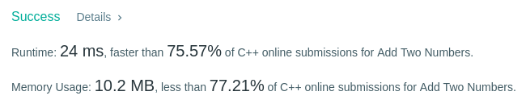
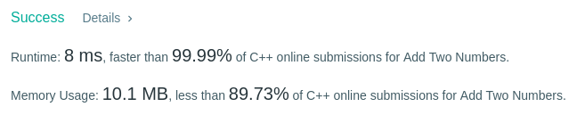

Algorithm Puzzles ~~everyday~~ ~~every week~~ sometimes: Add two numbers
<!--more-->

## Puzzle

Puzzle from [leetcode](https://leetcode.com):

You are given two non-empty linked lists representing two non-negative integers. The digits are stored in reverse order and each of their nodes contain a single digit. Add the two numbers and return it as a linked list.

You may assume the two numbers do not contain any leading zero, except the number 0 itself.

Example:

Input: (2 -> 4 -> 3) + (5 -> 6 -> 4)
Output: 7 -> 0 -> 8
Explanation: 342 + 465 = 807.

The template code provided by leetcode:

```cpp
/**
 * Definition for singly-linked list.
 * struct ListNode {
 *     int val;
 *     ListNode *next;
 *     ListNode(int x) : val(x), next(NULL) {}
 * };
 */
class Solution {
public:
    ListNode* addTwoNumbers(ListNode* l1, ListNode* l2) {
        
    }
};
```

## Solving

My first came out solution just like how we do sum on draft paper:

```cpp
/**
 * Definition for singly-linked list.
 * struct ListNode {
 *     int val;
 *     ListNode *next;
 *     ListNode(int x) : val(x), next(NULL) {}
 * };
 */
class Solution {
public:
    ListNode* addTwoNumbers(ListNode* l1, ListNode* l2) {
        ListNode* result = new ListNode(0);
        ListNode* resultHead = result;
        ListNode emptyNode{0}; 
        int carry = 0;
        while(1){
            carry = addTwoNode(l1, l2, carry, result);
            
            if((carry == 0) && (l1->next == nullptr) && (l2->next == nullptr)){
                return resultHead;
            }
            else{
                result->next = new ListNode(0);
                result = result->next;
                l1 = l1->next?l1->next:&emptyNode;
                l2 = l2->next?l2->next:&emptyNode;
            }
        }
    }
    int addTwoNode(ListNode* l1, ListNode* l2, int carry, ListNode* result){
        result->val = (l1->val + l2->val + carry);
        if(result->val >= 10){
            result->val -= 10;
            return 1;
        }else{
            return 0;
        }
    }
};
```

Time complexity: O(n)


It's do a little optimization:

```cpp
/**
 * Definition for singly-linked list.
 * struct ListNode {
 *     int val;
 *     ListNode *next;
 *     ListNode(int x) : val(x), next(NULL) {}
 * };
 */
class Solution {
public:
    ListNode* addTwoNumbers(ListNode* l1, ListNode* l2) {
        ListNode* result = new ListNode(0);
        ListNode* resultHead = result;
        ListNode emptyNode{0}; 
        int carry = 0;
        while(1){
            carry = addTwoNode(l1->val, l2->val, result);
            
            if((carry == 0) && (l1->next == nullptr) && (l2->next == nullptr)){
                return resultHead;
            }
            else{
                result->next = new ListNode(carry);
                result = result->next;
                l1 = l1->next?l1->next:&emptyNode;
                l2 = l2->next?l2->next:&emptyNode;
            }
        }
    }
    int addTwoNode(const int& l1, const int& l2, ListNode* result){
        result->val += (l1 + l2);
        if(result->val >= 10){
            result->val -= 10;
            return 1;
        }else{
            return 0;
        }
    }
};
```



Super! Better than 99.99%!
