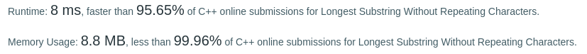

Algorithm Puzzles ~~everyday~~ ~~every week~~ sometimes: Longest Substring Without Repeating Characters
<!--more-->

## Puzzle
Puzzle from [leetcode](https://leetcode.com):

Given a string, find the length of the longest substring without repeating characters.

Example 1:

Input: "abcabcbb"
Output: 3 
Explanation: The answer is "abc", with the length of 3. 
Example 2:

Input: "bbbbb"
Output: 1
Explanation: The answer is "b", with the length of 1.
Example 3:

Input: "pwwkew"
Output: 3
Explanation: The answer is "wke", with the length of 3. 
             Note that the answer must be a substring, "pwke" is a subsequence and not a substring.

## Solving
### First came out solution

Traverse substring(not all of them, with a little bit optimization)

```cpp
class Solution {
public:
    int lengthOfLongestSubstring(const std::string& s) {
        int longest = 0;
        for(int i = 0; i < s.size(); i++){
            for(int j = i + 1; j < s.size() + 1; j++){
                if((j-i) <= longest){
                    continue;
                }
                if(checkStringUnique(s.substr(i,j-i)))
                    longest = (longest > (j - i)) ? longest : (j - i);
                else
                    break;
            }
        }
        return longest;
    }
private:
    bool checkStringUnique(std::string&& s){
        for(auto iter = s.begin(); iter != s.end(); ++iter){
            if(s.find_first_of(*iter, std::distance(s.begin(), iter)+1) != std::string::npos){
                return false;
            }
        }
        return true;
    }
};
```

Time complexity: O(n^3)


But this solution is not good enough since the time complexity is O(n^3). Only better than 62.78% cpp users.

### Sliding Window

Checked the reference answer, there is another solution: using sliding Window. 

```cpp
class Solution {
public:
     int lengthOfLongestSubstring(const std::string& s) {
        int n = s.size();
        int ans = 0;
        std::unordered_map<char, int> map;
        for (int j = 0, i = 0; j < n; j++) {
            auto res = map.find(s[j]);
            if (res != map.end()) {
                i = (res->second > i) ? res->second : i;
                res->second = j + 1;
            }else{
                map.insert({s[j], j + 1});
            }
            ans = (ans > (j - i + 1)) ? ans : (j - i + 1);
            
        }
        return ans;
    }
};
```

Time complexity: O(n)


It's better than 85.71% now.

### Assuming ASCII 128

The third way to solve this is assuming the string inputs are all ASCII 128 characters... In this case no hash table is needed.

```cpp
class Solution {
public:
     int lengthOfLongestSubstring(const std::string& s) {
        int n = s.length(), ans = 0;
        int index[128] = {0};
        for (int j = 0, i = 0; j < n; j++) {
            i = index[s[j]] > i ? index[s[j]] : i;
            ans = (ans > (j - i + 1)) ? ans : (j - i + 1);
            index[s[j]] = j + 1;
        }
        return ans;
    }
};
```



This solution is faster than 95.65%.

