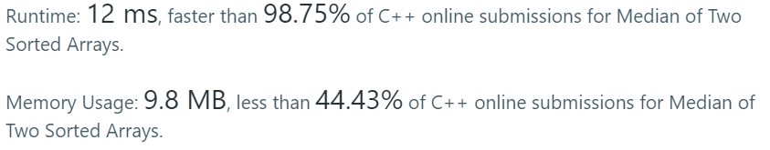

Algorithm Puzzles ~~everyday~~ ~~every week~~ sometimes: Median of Two Sorted Arrays

<!--more-->

## Puzzle
Puzzle from [leetcode](https://leetcode.com):

There are two sorted arrays nums1 and nums2 of size m and n respectively.

Find the median of the two sorted arrays. The overall run time complexity should be O(log (m+n)).

You may assume nums1 and nums2 cannot be both empty.

Example 1:

nums1 = [1, 3]
nums2 = [2]

The median is 2.0
Example 2:

nums1 = [1, 2]
nums2 = [3, 4]

The median is (2 + 3)/2 = 2.5

## Solving

The first came out solution is using merge sort since the sub-vectors are already sorted. The funny part is the puzzle requests time complexity should be O(log (m+n)), which is same as merge sort.

```cpp
class Solution {
public:
    double findMedianSortedArrays(const vector<int>& nums1,const vector<int>& nums2) {
        vector<int> nums3;
        nums3.resize(nums1.size()+nums2.size());
        
        auto iter1 = nums1.begin();
        auto iter2 = nums2.begin();
        auto iter3 = nums3.begin();
        
        for(;; ++iter3){
            if(iter1 == nums1.end()){
                std::copy(iter2,nums2.end(),iter3);
                break;
            }
            if(iter2 == nums2.end()){
                std::copy(iter1,nums1.end(),iter3);
                break;
            }
            if(*iter1<=*iter2){
                *iter3 = *iter1;
                ++iter1;
            }else{
                *iter3 = *iter2;
                ++iter2;
            }
        }
        
        if(nums3.size()%2 == 1){
            return nums3[(nums3.size()-1)/2];
        }else{
            return (nums3[nums3.size()/2] + nums3[nums3.size()/2 - 1])/2.0;
        }
        
    }
};
```

Time complexity: O(log(m+n))

Result I got:


Better than 98.75%. BTW it seems I can get different result with the exactly same code...
