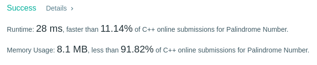

Algorithm Puzzles ~~everyday~~ ~~every week~~ sometimes: Palindrome Number

<!--more-->

## Puzzle
Puzzle from [leetcode](https://leetcode.com):

Determine whether an integer is a palindrome. An integer is a palindrome when it reads the same backward as forward.

Example 1:

Input: 121
Output: true
Example 2:

Input: -121
Output: false
Explanation: From left to right, it reads -121. From right to left, it becomes 121-. Therefore it is not a palindrome.
Example 3:

Input: 10
Output: false
Explanation: Reads 01 from right to left. Therefore it is not a palindrome.

## Solving
### First came out solution
My first came out solution is using string:

```cpp
class Solution {
  public:
    bool isPalindrome(int x) {
        if (x < 0) {
            return false;
        }
        std::stringstream stream;
        std::string str;
        stream << x;
        stream >> str;
        size_t length = str.length();
        auto iterHead = str.cbegin();
        auto iterTail = str.cend() - 1;
        for(size_t i = 0; i < length; i+=2){
            if(*iterHead == *iterTail){
                ++iterHead;
                --iterTail;
            }else{
                return false;
            }
        }
        return true;
    }
};

```

I know it's not the best solution at very beginning, but it still surprised me when submitted:



### Another approach

Since the performance of transferring to string is so bad, I'd like to try to handle it in integer only.

```cpp
class Solution {
  public:
    bool isPalindrome(int x) {
        int reverted = 0;

        if (x % 10 == 0 && x != 0) {
            return false;
        }

        while (x > reverted) {
            reverted = reverted * 10 + x % 10;
            x /= 10;
        }

        return (x == reverted) || (x == reverted / 10);
    }
};
```


