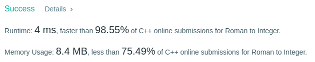

Algorithm Puzzles ~~everyday~~ ~~every week~~ sometimes: Roman to Integer
<!--more-->

## Puzzle

Puzzle from [leetcode](https://leetcode.com):
Roman numerals are represented by seven different symbols: I, V, X, L, C, D and M.
```
Symbol       Value
I             1
V             5
X             10
L             50
C             100
D             500
M             1000
```
For example, two is written as II in Roman numeral, just two one's added together. Twelve is written as, XII, which is simply X + II. The number twenty seven is written as XXVII, which is XX + V + II.

Roman numerals are usually written largest to smallest from left to right. However, the numeral for four is not IIII. Instead, the number four is written as IV. Because the one is before the five we subtract it making four. The same principle applies to the number nine, which is written as IX. There are six instances where subtraction is used:

I can be placed before V (5) and X (10) to make 4 and 9.<br>
X can be placed before L (50) and C (100) to make 40 and 90.<br>
C can be placed before D (500) and M (1000) to make 400 and 900.<br>
Given a roman numeral, convert it to an integer. Input is guaranteed to be within the range from 1 to 3999.<br>

## Solving

```cpp
class Solution {
  public:
    int romanToInt(const string& s) {
        int ret = 0;
        for (auto iter = s.begin(); iter != s.end(); ++iter) {
            switch (*iter) {
                case 'I':
                    if (*(iter + 1) == 'V') {
                        ret += 4;
                        ++iter;
                    } else if (*(iter + 1) == 'X') {
                        ret += 9;
                        ++iter;
                    } else {
                        ret += 1;
                    }
                    break;

                case 'V':
                    ret += 5;
                    break;

                case 'X':
                    if (*(iter + 1) == 'L') {
                        ret += 40;
                        ++iter;
                    } else if (*(iter + 1) == 'C') {
                        ret += 90;
                        ++iter;
                    } else {
                        ret += 10;
                    }
                    break;

                case 'L':
                    ret += 50;
                    break;

                case 'C':
                    if (*(iter + 1) == 'D') {
                        ret += 400;
                        ++iter;
                    } else if (*(iter + 1) == 'M') {
                        ret += 900;
                        ++iter;
                    } else {
                        ret += 100;
                    }
                    break;

                case 'D':
                    ret += 500;
                    break;

                case 'M':
                    ret += 1000;
                    break;
            }
        }
        return ret;
    }
};
```
Result:

Runtime beats 98.55% in all cpp submissions:

