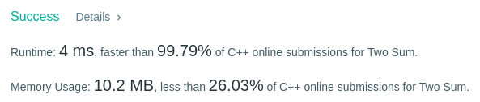
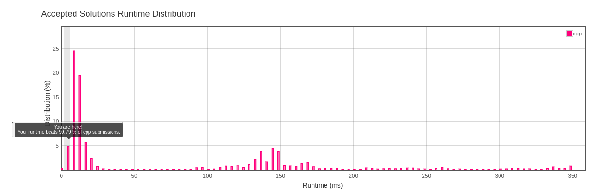

Algorithm Puzzles ~~everyday~~ ~~every week~~ sometimes: Two Sum
<!--more-->

## Puzzle

Puzzle from [leetcode](https://leetcode.com):

Given an array of integers, return **indices** of the two numbers such that they add up to a specific target.

You may assume that each input would have **exactly** one solution, and you may not use the same element twice.

Example:
```
Given nums = [2, 7, 11, 15], target = 9,

Because nums[0] + nums[1] = 2 + 7 = 9,
return [0, 1].
```

The template code provided by leetcode:

```cpp
class Solution {
public:
    vector<int> twoSum(vector<int>& nums, int target) {

    }
};
```

## Solving

The first came out solution from my head is for every elements for-loop traverse once to find the result:

```cpp
class Solution {
public:
    vector<int> twoSum(vector<int>& nums, int target) {
        for(const auto& a : nums){
            auto tryToFind = target - a;
            for(...)
                //if tryToFind exist in nums
                //return
        }
    }
};
```

It's really ez! But time complexity will be **O(n^2)** since there are 2 for-loops inside. There must be a better way, I can't submit with this solution!

<div  align="center"> 

</div>


So what kind of search method is better? Maybe hash table?

```cpp
class Solution {
public:
    vector<int> twoSum(vector<int>& nums, int target) {
        std::unordered_map<int,int> map;
        int i = 0;
        for(const auto& a : nums){
            map.insert({a,i});
            auto res = map.find(target-a);
            if(res != map.end()){
                if(i != res->second)
                return vector<int>({i, res->second});
            }
            i++;
        }
        throw std::invalid_argument("");
    }
};
```
Bravo! Time complexity is **O(n)** now!(but we used more space)
results:

What? Only better than 88.56%? OK it still can get improvements by replacing for-each with for-loop(But why I choose for-each at the first time...)

```cpp
class Solution {
public:
    vector<int> twoSum(vector<int>& nums, int target) {
        std::unordered_map<int,int> map;
        for(int i = 0; i < nums.size(); i++){
            map.insert({nums[i],i});
            auto res = map.find(target-nums[i]);
            if(res != map.end()){
                if(i != res->second)
                return vector<int>({i, res->second});
            }
        }
        throw;
    }
};
```
result:




Cool, better than 99.79% now!
