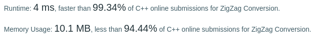

Algorithm Puzzles ~~everyday~~ ~~every week~~ sometimes: ZigZag Conversion

<!--more-->

## Puzzle

Puzzle from [leetcode](https://leetcode.com):

The string "PAYPALISHIRING" is written in a zigzag pattern on a given number of rows like this: (you may want to display this pattern in a fixed font for better legibility)
```
P   A   H   N
A P L S I I G
Y   I   R
```
And then read line by line: "PAHNAPLSIIGYIR"

Write the code that will take a string and make this conversion given a number of rows:

string convert(string s, int numRows);
Example 1:

Input: s = "PAYPALISHIRING", numRows = 3
Output: "PAHNAPLSIIGYIR"
Example 2:

Input: s = "PAYPALISHIRING", numRows = 4
Output: "PINALSIGYAHRPI"
Explanation:
```
P     I    N
A   L S  I G
Y A   H R
P     I
```

## Solving
### First came out solution

|   0   |       |       |   6   |       |       |  12   |
| :---: | :---: | :---: | :---: | :---: | :---: | :---: |
|   1   |       |   5   |   7   |       |  11   |  13   |
|   2   |   4   |       |   8   |  10   |       |  14   |
|   3   |       |       |   9   |       |       |  15   |

It's obvious that the output is periodic for first row:
```
0 = 2 * (numRows - 1) * 0
6 = 2 * (numRows - 1) * 1
12 = 2 * (numRows - 1) * 2
```

Let <span style="color:red">*T = 2 * (numRows - 1)*</span>, for next row(row[1]):
```
1 = T * 0 + 1 
5 = T * 1 - 1
7 = T * 1 + 1
11 = T * 2 - 1
13 = T * 2 + 1
```

For row[2]:
```
2 = T * 0 + 2
4 = T * 1 - 2
8 = T * 1 + 2
... 
```

Change 1,2 to *rowIndex* which start from *0* to *numRows - 1* :
```
0 = T * 0 + rowIndex (rowIndex = 0)
1 = T * 0 + rowIndex (rowIndex = 1)
2 = T * 0 + rowIndex (rowIndex = 2)
```


Cool, can start coding now

```cpp
class Solution {
  public:
    std::string convert(std::string s, int numRows) {
        if (numRows == 1) {
            return s;
        }
        std::string res;
        size_t maxLength = s.size();
        size_t T = 2 * (numRows - 1);
        for (size_t rowIndex = 0; rowIndex < numRows; ++rowIndex) {
            size_t oriIndex = rowIndex;

            while (oriIndex < maxLength) {
                res.push_back(s[oriIndex]);
                size_t insertOne = oriIndex + T - rowIndex - rowIndex;
                if (insertOne > oriIndex && insertOne < oriIndex + T &&
                    insertOne < maxLength) {
                    res.push_back(s[insertOne]);
                }

                oriIndex += T;
            }
        }
        return res;
    }
};
```

Result:


Let's do some optimization:

```cpp
class Solution {
  public:
    const std::string convert(const std::string& s, int numRows) {
        if (numRows == 1) {
            return s;
        }
        std::string res;
        size_t maxLength = s.size();
        size_t T = 2 * (numRows - 1);
        for (size_t rowIndex = 0; rowIndex < numRows; ++rowIndex) {
            size_t oriIndex = rowIndex;

            while (oriIndex < maxLength) {
                res.push_back(s[oriIndex]);
                size_t insertOne = oriIndex + T - rowIndex - rowIndex;
                if (insertOne > oriIndex && insertOne < oriIndex + T &&
                    insertOne < maxLength) {
                    res.push_back(s[insertOne]);
                }

                oriIndex += T;
            }
        }
        return std::move(res);
    }
};
```

Result:


Looks like we also can change *size_t T = 2 * (numRows - 1)* to *size_t T = numRows + numRows -2* to use add instead of multiply

```cpp
class Solution {
  public:
    const std::string convert(const std::string& s, int numRows) {
        if (numRows == 1) {
            return s;
        }
        std::string res;
        size_t maxLength = s.size();
        size_t T = (numRows + numRows - 2);
        for (size_t rowIndex = 0; rowIndex < numRows; ++rowIndex) {
            size_t oriIndex = rowIndex;

            while (oriIndex < maxLength) {
                res.push_back(s[oriIndex]);
                size_t insertOne = oriIndex + T - rowIndex - rowIndex;
                if (insertOne > oriIndex && insertOne < oriIndex + T &&
                    insertOne < maxLength) {
                    res.push_back(s[insertOne]);
                }

                oriIndex += T;
            }
        }
        return std::move(res);
    }
};
```

Result:



Super, better than 99.34% now!
