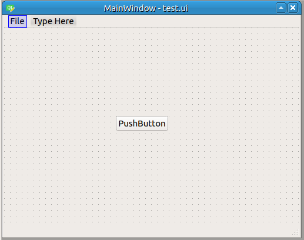
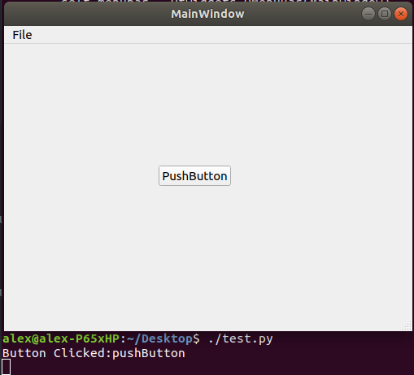

Recently I start to evaluate the feasibility of porting one old C++ Qt4 project to PyQt5 since Python is more friendly for some engineers.

<!--more-->

The following steps was test on Ubuntu.
## Installation
```bash
sudo pip3 install PyQt5
```

If you haven't install Qt Designer yet, we'd like to suggest install it as well:
```bash
sudo apt install qttools5-dev-tools
```

## The first PyQt5 program
After installation, we can perform a quick check by a simple PyQt5 program:
```py
#!/usr/bin/python3

import sys
from PyQt5.QtWidgets import QApplication, QLabel

app=QApplication(sys.argv)
label = QLabel('Hello PyQt5!')
label.show()
sys.exit(app.exec_())
```
We could see a simple window with a label on it after executing this simple code:


In this code we created a `QApplication` and run the event loop via `exec_()` method.

## Using Qt Designer to design UI
In the first example we "designed" an application UI by coding, but in real project we have much more complicated UI for applications which is hard to design without UI designer. For PyQt5, we could use Qt Designer to design UI as before but we need one tiny utility to transform <span style="color:red">*.ui</span> file into python code.

i.e. If we drawn a simple UI like this in Qt Designer and save it as <span style="color:red">test.ui</span>:



Then we use <span style="color:red">pyuic5</span> to generate python code from <span style="color:red">test.ui</span>:

```bash
pyuic5 test.ui -o test_ui.py
```

Then we can get **test_ui.py**:

```py
# -*- coding: utf-8 -*-

# Form implementation generated from reading ui file 'test.ui'
#
# Created by: PyQt5 UI code generator 5.14.1
#
# WARNING! All changes made in this file will be lost!


from PyQt5 import QtCore, QtGui, QtWidgets


class Ui_MainWindow(object):
    def setupUi(self, MainWindow):
        MainWindow.setObjectName("MainWindow")
        MainWindow.resize(502, 376)
        self.centralwidget = QtWidgets.QWidget(MainWindow)
        self.centralwidget.setObjectName("centralwidget")
        self.pushButton = QtWidgets.QPushButton(self.centralwidget)
        self.pushButton.setGeometry(QtCore.QRect(190, 150, 89, 25))
        self.pushButton.setObjectName("pushButton")
        MainWindow.setCentralWidget(self.centralwidget)
        self.menubar = QtWidgets.QMenuBar(MainWindow)
        self.menubar.setGeometry(QtCore.QRect(0, 0, 502, 22))
        self.menubar.setObjectName("menubar")
        self.menuFile = QtWidgets.QMenu(self.menubar)
        self.menuFile.setObjectName("menuFile")
        MainWindow.setMenuBar(self.menubar)
        self.statusbar = QtWidgets.QStatusBar(MainWindow)
        self.statusbar.setObjectName("statusbar")
        MainWindow.setStatusBar(self.statusbar)
        self.actionasd = QtWidgets.QAction(MainWindow)
        self.actionasd.setObjectName("actionasd")
        self.menuFile.addAction(self.actionasd)
        self.menubar.addAction(self.menuFile.menuAction())

        self.retranslateUi(MainWindow)
        QtCore.QMetaObject.connectSlotsByName(MainWindow)

    def retranslateUi(self, MainWindow):
        _translate = QtCore.QCoreApplication.translate
        MainWindow.setWindowTitle(_translate("MainWindow", "MainWindow"))
        self.pushButton.setText(_translate("MainWindow", "PushButton"))
        self.menuFile.setTitle(_translate("MainWindow", "File"))
        self.actionasd.setText(_translate("MainWindow", "Open"))

```
## Quick test with clicked event

Then we can start coding with this file by inheriting `class Ui_MainWindow`:

```py
#!/usr/bin/python3

import sys
from PyQt5.QtWidgets import QApplication, QMainWindow
from test_ui import Ui_MainWindow


class MyMainWindow(QMainWindow, Ui_MainWindow):
    def __init__(self):
        super(MyMainWindow, self).__init__()
        self.setupUi(self)
        self.pushButton.clicked.connect(self.onBtnClicked)

    def onBtnClicked(self):
        print("Button Clicked:" + self.sender().objectName())


app = QApplication([])
mainWindow = MyMainWindow()

mainWindow.show()

sys.exit(app.exec_())

```
Here we defined a `class MyMainWindow` which inheriting from `QMainWindow` and `Ui_MainWindow`, then we defined `__init__` method which will `setupUi` and binding button clicked event with `onBtnClicked`. When **pushButton** was clicked, we can see output in terminal:


## Conclusion
So far we still not sure about the performance differences between Qt(C++) and PyQt5 but as far as I can see PyQt5 could be one of the options for those engineers who is not very good at C++.
