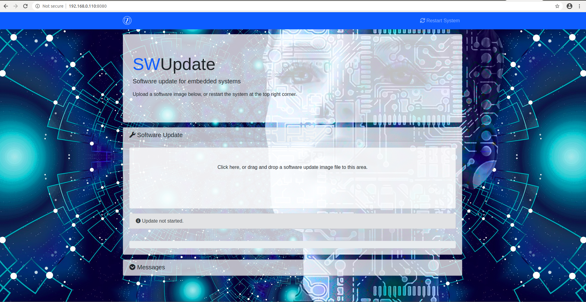
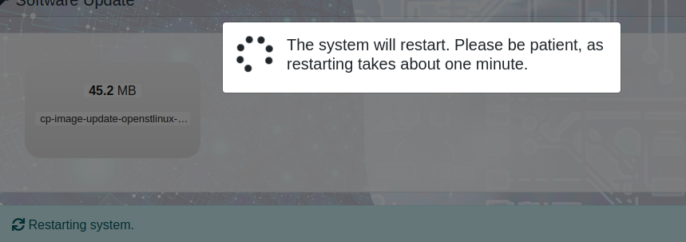

[SWUpdate](https://github.com/sbabic/meta-swupdate-boards) is a popular embedded system update framework. I'm trying to bring up a OTA update system on stm32mp1, and this OTA system will base on SWUpdate. This post records steps need to be done to install SWUpdate system into Yocto Linux, and create a single copy image to test it.
<!--more-->

## meta-swupdate

[SWUpdate](https://github.com/sbabic/meta-swupdate-boards) was provided to help generate SWUpdate supported images. Clone it to the layers path and add it into <span style="color:red">**conf/bblayers.conf**</span>.
> Notes:
> This layer depends on several recipes in meta-openembedded. i.e. **librsync** and **libubootenv**. For STM32MP distribution, the default meta-openembedded version is too old and those recipes are not included yet. To continue, add those recipes manually or reset meta-openembedded to a newer version.

## Boards related configs

### SWUpdate defconfig
<span style="color:red">**defconfig**</span> was required by swupdate.inc. Use menuconfig to create one for your boards as defconfig.

> Notes:
> If <span style="color:blue">CONFIG_WEBSERVER</span> and <span style="color:blue">CONFIG_MONGOOSE</span> was enabled in menuconfig, target boards will run a mongoose webserver so user can access it through <span style="color:red">\<target_ip\>:8080</span> by default

### SWUpdate swupdate.cfg

<span style="color:red">**swupdate.cfg**</span> will be copied to target as swupdate runtime configurations. In **swupdate.cfg** we can set `board idendity`,`public-key`,`suricatta`, `webserver` and even more:

```
globals :
{
	verbose = true;
	loglevel = 5;
	syslog = true;
	no-downgrading = "1.0.0";
	postupdatecmd = "reboot";
};

download :
{
	retries = 3;
	timeout = 1800;
};

identify : (
	{ name = "stm32mp157a-cp"; value = "1.0"; }
);

webserver :
{
	document_root = "/www";
	userid		= 0;
	groupid		= 0;
}

```

### 09-swupdate-args

This file defines extra parameters for swupdate daemon.

```sh
HARDWARE="stm32mp157a-cp:1.0"
CFGFILE="/etc/swupdate.cfg"
SWUPDATE_ARGS="-H ${HARDWARE} -f ${CFGFILE}"

```

Here we specific hardware information thus SWUpdate daemon will check swu image hardware compatibility before updating. If user trying to use swu image without specific hardware compatibility, SWUpdate will refuse to update.

### Use **bbappend** to add board related configs in

In boards specific layer, create file `swupdate_%.bbappend`:

```bb
FILESEXTRAPATHS_append := "${THISDIR}/${PN}:"

PACKAGECONFIG_CONFARGS = ""

SRC_URI += " \
    file://swupdate.cfg \
    file://09-swupdate-args \
    "

do_install_append() {
    install -m 0644 ${WORKDIR}/09-swupdate-args ${D}${libdir}/swupdate/conf.d/

    install -d ${D}${sysconfdir}
    install -m 0644 ${WORKDIR}/swupdate.cfg ${D}${sysconfdir}
}

```

Now we have structure like this in boards specific layer:

```
└── swupdate
    ├── swupdate
    │   ├── 09-swupdate-args
    │   ├── defconfig
    │   └── swupdate.cfg
    └── swupdate_%.bbappend
```

## Install to image

Then we need to add `swupdate`, `swupdate-www` and `libubootenv-bin` into image.

```
IMAGE_INSTALL_append = " swupdate swupdate-www libubootenv-bin"
```

Flash the built image to target, make sure PC and target board are in same LAN, then we can access <span style="color:red">\<target_ip\>:8080</span> :



## Create a single copy update image for test

Now it's time to create a swu image to test SWUpdate system.

### sw-description

<span style="color:red">**sw-description**</span> defines the compatibility and usage of `swu` images. Here we defined a single copy update image, which is compatible with boards `stm32mp157a-cp` and will update target rootfs:

```
software =
{
	version = "1.0.0";

	stm32mp157a-cp = {
		hardware-compatibility: [ "1.0" ];
		images: (
			{
				filename = "cp-image-core-openstlinux-eglfs-stm32mp1-cp.ext4.gz";
				type = "raw";
				sha256 = "@cp-image-core-openstlinux-eglfs-stm32mp1-cp.ext4.gz";
				installed-directly = true;
				compressed = true;
				device = "/dev/mmcblk0p6";
			}
		);
	};
}

```

### Recipe for update image

To generate a `swu` file from bitbake, we need to create a recipe for update image. In my scenario it was named as **cp-image-update.bb** :

```
DESCRIPTION = "SWUpdate compound image"

LICENSE = "MIT"
LIC_FILES_CHKSUM = "file://${COMMON_LICENSE_DIR}/MIT;md5=0835ade698e0bcf8506ecda2f7b4f302"

inherit swupdate

SRC_URI = " \
    file://sw-description \
"

# images to build before building swupdate image
IMAGE_DEPENDS = "cp-image-core"

# images and files that will be included in the .swu image
SWUPDATE_IMAGES = "cp-image-core-openstlinux-eglfs-stm32mp1-cp"

SWUPDATE_IMAGES_FSTYPES[cp-image-core-openstlinux-eglfs-stm32mp1-cp] = ".ext4.gz"

```

Now we have structure like this in boards specific layer:

```
.
├── images
│   ├── cp-image-update
│   │   └── sw-description
│   └── cp-image-update.bb
```

To generate `swu` image, call `bitbake cp-image-update`.

### Generate update image without image recipe

Sometimes we want to generate a `swu` image for test purpose, in this scenario we can skip `bitbake` and use a simple shell script to generate `swu` image quickly:

```sh
#!/bin/sh

CONTAINER_VER="1.0"
PRODUCT_NAME="stm32mp157-cp"
FILES="sw-description cp-image-core-openstlinux-eglfs-stm32mp1-cp.ext4.gz"
for i in $FILES;do
        echo $i;done | cpio -ov -H crc >  ${PRODUCT_NAME}_${CONTAINER_VER}.swu

```

### Quick check structure of generated swu image

Since swu image was cpio based, we can use `cat` to check structure of it:

```
cat cp-image-update-openstlinux-eglfs-stm32mp1-cp.swu | cpio -it
sw-description
cp-image-core-openstlinux-eglfs-stm32mp1-cp.ext4.gz
88360 blocks
```

## Test with generated swu image on target

### Use web interface

We can trigger update easily by uploading `swu` image through webserver:


We defined 	`postupdatecmd = "reboot";` in <span style="color:red">**swupdate.cfg**</span>, so system will automatically reboot:



### Use command line interface

We also can use command line to trigger update if we have an usb drive which contains **swu** image and has connected to target:

```
swupdate -i /media/cp-image-update-openstlinux-eglfs-stm32mp1-cp.swu -H stm32mp157a-cp:1.0
```
