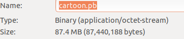
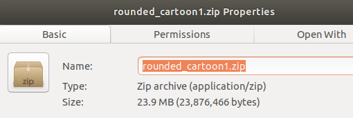
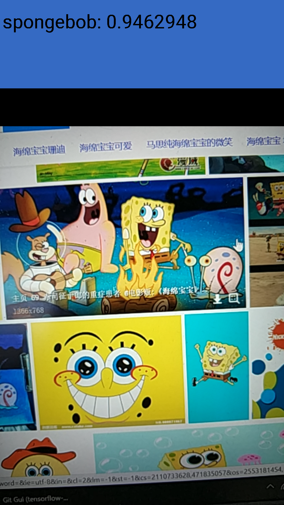
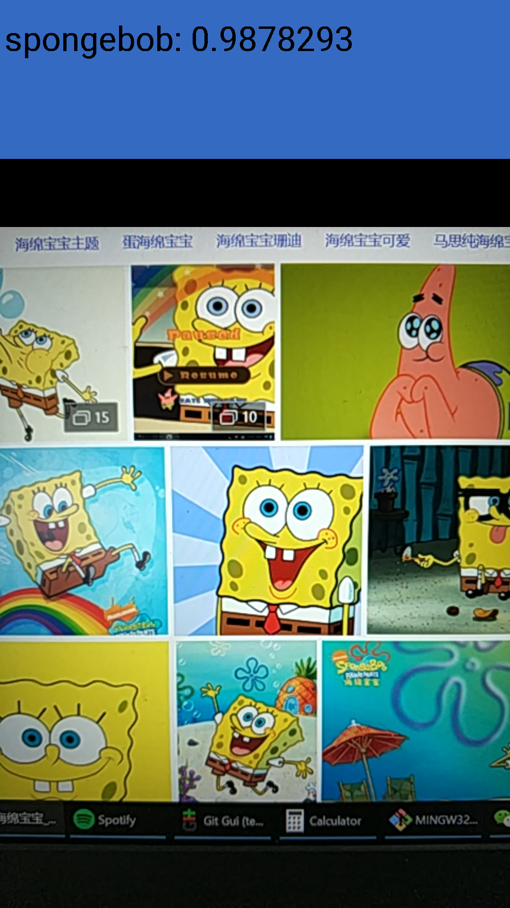
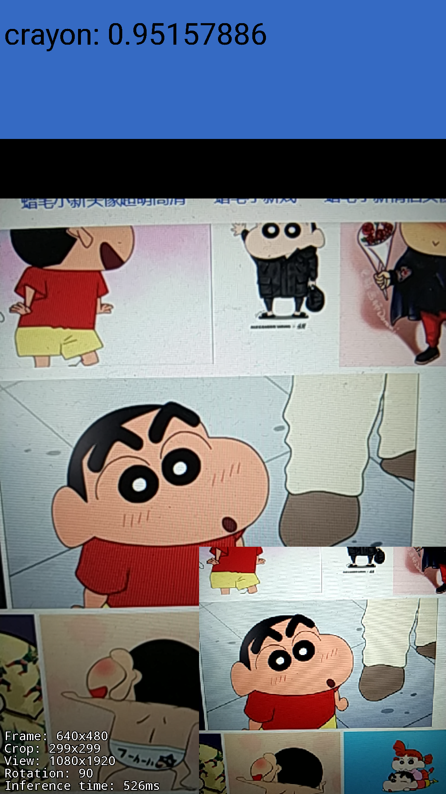

  摸索了几天，终于用TensorFlow成功训练了一个能够识别三种动漫人物的AI。写篇post记录一下。由于训练是在虚拟机上跑的，没有办法使用显卡，所以这次的训练只用到了CPU。GPU版本的训练下次再写。
<!--more-->
训练环境：
  OS: Ubuntu 17.10(VMWare)
  CPU:i5-6300HQ(开了两个核给虚拟机)
  RAM:4G(16G只开了4G给虚拟机)
## 配置开发环境
  安装TensorFlow是一件十分麻烦的事情。你需要python(推荐python3以上)及各种扩展模块，bazel等等，这些安装操作会频繁地更改环境变量，稍有不慎就可能导致崩溃，还极难恢复。因此推荐使用Docker来进行环境搭建。
### 什么是Docker
  Docker 是一个开源的应用容器引擎，让开发者可以打包他们的应用以及依赖包到一个可移植的容器中，然后发布到任何流行的 Linux 机器上，也可以实现虚拟化。你可以把容器看成一个沙箱。Docker提供了一些已经装完TensorFlow开发所需的各种依赖包的image。我们只需要使用Docker下载这些image，就可以在Docker的容器中进行开发，而不用担心安装各种扩展包导致系统崩溃。更重要的是，你可以基于一个image创建多个互不干扰的容器，我们可以在容器里进行各种变态的实验而不需要反复下载image。(特别是这些image由于某些众所周知的原因在大陆下载极其缓慢甚至不能下载)
### 如何安装Docker
  参考Docker的[官方安装指南](https://docs.docker.com/engine/installation/linux/docker-ce/ubuntu/#extra-steps-for-aufs)可以非常轻松地完成Docker安装。
### 下载集成TensorFlow开发环境的镜像
  接下来的步骤需要root权限并需要访问Google服务器。
```bash
# docker run -it gcr.io/tensorflow/tensorflow:latest-devel
```
执行该指令，Docker会自动下载镜像。你也可以选择下载不同版本的镜像：
CPU版：gcr.io/tensorflow/tensorflow
CPU版带开发环境：gcr.io/tensorflow/tensorflow:latest-devel
GPU版：gcr.io/tensorflow/tensorflow:latest-gpu
GPU版带开发环境：gcr.io/tensorflow/tensorflow:latest-devel-gpu
### 搭建完成
  经过漫长的等待，如果命令行变成root@xxxxxxxxxxxx 说明下载安装完成，用户已经在Docker容器中了(xxxxxxxxx为当前容器ID)。

## 准备训练样本
  机器学习需要大量样本。这里我直接使用了Google图片的搜索结果作为样本，这样的方式方便快捷，但样本质量不一定高。当你尝试在Google图片中搜索“蜡笔小新”，搜索结果很有可能出现一幅没有包含蜡笔小新的图，该图可能只包含有动感超人甚至小白。这些错误的“正样本”会对训练结果产生影响。
  分别在Google图片中搜索“Crayon Shin-chan”、“spongebob”、“minions”可以找到大量图片。可以使用Chrome的一个名为“Fatkun Batch Download Image”的扩展程序进行图片批量下载。新建一个cartoon文件夹，将图片分别放在其子文件夹cartoon/crayon cartoon/minions cartoon/spongebob下。每个目录有800~900张图。
## 开始训练
  接下来的步骤需要root权限并需要访问Google服务器。
### 创建工作目录
  新建一个名为tf_files的文件夹，并将cartoon文件夹copy进来。
```bash
cd ~
mkdir tf_files
cp cartoon tf_files
```
### 运行容器并挂载工作目录
```bash
docker run -it -v $(pwd)/tf_files:/tf_files \
  gcr.io/tensorflow/tensorflow:latest-devel
```
### 使用迁移学习进行训练
#### 什么是迁移学习
  迁移学习(Transfer Learning)试图使用已经训练好的模型参数帮助新模型训练新的数据集。当数个训练任务及数据有一定程度的相关性，使用迁移学习可以加快新模型的学习而不用花费大量时间和样本从头开始训练。我们的任务是一个图像识别任务，这与Google训练好的Inception模型有较大的相关性，而我们的样本又较少，因此基于Inception模型进行迁移学习是个不错的选择。
#### 什么是Inception模型
  Inception模型是一种用于图像分类的卷积神经网络模型。这是一个多层、有着极其复杂结构的卷积神经网络。该模型可以识别超过1000种物品，但并不包括我们想要的动漫人物。Github上有提到Inception模型训练是在一台有128GB RAM和8块Tesla K40的电脑上进行的(We targeted a desktop with 128GB of CPU ram connected to 8 NVIDIA Tesla K40 GPU)。如果你想在你的个人电脑上尝试从零开始训练一个这种量级的神经网络，你可能需要数个星期才能完成训练，还有很大的可能性出现run out of GPU memory或run out of CPU memory导致训练失败。在这里我们将尝试使用Tensorflow提供的retrain.py训练整个神经网络的最后一层，即决策层/分类层，而倒数第二层被称为Bottlenecks(瓶颈层)。我们将利用Bottlenecks产生的有效数据，供给最后的决策层/分类层做出最后的分类预测。
#### 开始训练
```bash
cd /tensorflow/
python tensorflow/tensorflow/examples/image_retraining/retrain.py \
  --bottleneck_dir=/tf_files/bottlenecks \
  --how_many_training_steps 4000 \
  --model_dir=/tf_files/inception \
  --output_graph=/tf_files/cartoon.pb \
  --output_labels=/tf_files/cartoon.txt \
  --image_dir /tf_files/cartoon
```
在这里我们设置了bottleneck的输出目录，training_steps，模型位置，pb文件及label输出位置，样本图片位置。一般而言training_steps越多，训练时间越长，效果越好，反之则反。如果模型位置没有需要的模型，该脚本会尝试自动下载。pb文件就是训练完成的模型，label是一个txt文件，里面包含了我们训练完成的模型能识别的对象名称。不出意外的话，几十分钟后训练就可以完成。


可以看到我们的模型的测试识别准确率达到了95.5%。

tf_files下生成了我们训练的模型cartoon.pb以及label文件cartoon.txt。打开cartoon.txt可以看到，该模型可以识别的对象有crayon(蜡笔小新)、minions(小黄人)、spongebob(海绵宝宝)三种(就是cartoon文件夹下子文件夹的名字)。我这里生成的pb文件有87.4MB。


## 优化与压缩
### 为什么要进行优化和压缩
  对于移动设备(例如智能手机)和嵌入式设备(例如跑Android Things或Linux的设备)来说，这个模型文件太大了。如果你尝试把其打包为apk文件，你可能会得到一个将近100MB的apk，这对用户来说可能体验并不太友好。因此我们需要对该模型进行优化和压缩以减小其体积。
如果你尝试直接将该pb文件压缩为zip文件，你会发现压缩文件大小只比原来小了几MB。我尝试使用优化脚本对pb文件进行优化，优化后的压缩效果还不错。
### 使用optimize_for_inference优化工具
  optimize_for_inference脚本将会帮助我们删除当前模型中输入输出之前不需要的节点，并进行一些其他优化以提高运行性能。
```bash
python tensorflow/python/tools/optimize_for_inference.py \
  --input=/tf_files/cartoon.pb \
  --output=/tf_files/optimized_cartoon.pb \
  --input_names="Mul" \
  --output_names="final_result"
```
优化完成后我们可以得到一个名为optimized_cartoon.pb的优化过的模型文件。但是只比原来小了0.2MB。压缩为zip文件也小不了多少:(
### 使用quantize_graph工具进行进一步优化
  看来是时候放大招了。我们将使用quantize_graph对模型文件中的权重参数进行四舍五入。这一方式将会降低预测准确率(但是通常只降低1%左右)。
```bash
python tensorflow/tools/quantization/quantize_graph.py \
  --input=/tf_files/optimized_cartoon.pb \
  --output=/tf_files/rounded_cartoon.pb \
  --output_node_names="final_result" \
  --mode=weights_rounded
```
  通常来说，新生成的rounded_cartoon.pb大小并不会发生太大变化，但是当我尝试将其压缩为zip文件时，我得到了一个令人满意的压缩包大小：23.9MB



  现在如果我们尝试将其作为资源文件打包进apk，可以得到一个小得多的安装包，用户下载的时间大大减少了。
## 测试与验证
  首先我们将测试经过optimize_for_inference优化的optimized_cartoon.pb。为了方便测试，我使用了TensorFlow在Android上的demo app，你可以在Github上找到其源码。要让我们的模型文件能够在这个demo上正常工作，我们需要做一点微小的工作。
1.复制optimized_cartoon.pb及cartoon.txt文件至app/src/main/assets
2.在ClassifierActivity.java中修改如下部分：
```java
  private static final int INPUT_SIZE = 299;
  private static final int IMAGE_MEAN = 128;
  private static final float IMAGE_STD = 128;
  private static final String INPUT_NAME = "Mul";
  private static final String OUTPUT_NAME = "final_result";


  private static final String MODEL_FILE = "file:///android_asset/optimized_cartoon.pb";
  private static final String LABEL_FILE = "file:///android_asset/cartoon.txt";
```
这里我们限制输入图像为299x299, 并更改INPUT_NAME和OUTPUT_NAME。当然还有MODEL_FILE和LABEL_FILE的位置。测试样例我直接用手机拍的，由于限制了输入图像大小为299x299，所以图片质量比较差，但是还是得到了不错的运行结果：



再看看经过quantize_graph优化的：



## 下一步
  接下来我们可以尝试进行音频方向的机器学习探索。目前还在研究中，等有了有趣的发现后再写篇post吧。
