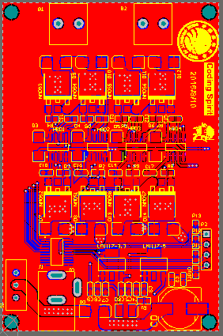
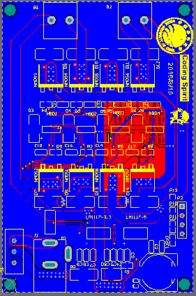

写篇post总结一下当年做平衡车的一些经验。这篇post是概述性质的，详细的软硬件设计以后有时间再写吧。

<!--more-->

## 写在前面
其实大二大三的时候都有参加智能车竞赛(原来叫飞思卡尔智能车竞赛，简称飞赛，后来飞思卡尔被nxp收购，改名恩智浦智能车竞赛..)，但是学院有个政策，不允许同一年既参加电子设计竞赛（简称电赛）又参加飞赛，理由是要让更多的同学有机会参加到比赛中（至少老师是这么告诉我们的），于是大二那一年做智能车做到一半就弃权参加电赛去了。不过后来我和我的小伙伴们发现，居然有些同学两个比赛都参加了，这TM就很尴尬了。。

## 硬件基本架构
概括来讲，需要关心的是三个部份:
### 1.电源
首先稳压电路是一定会有的，我们选用了LM1117，外围电路简单，使用十分方便，可替代的LDO也不少。另外如果使用MOS管自己搭H桥，就需要boost电路了。
### 2.主控部分
这个部分包括MCU最小系统以及各种传感器。对于平衡车而言，陀螺仪、角度传感器和编码器、图像传感器都算是核心传感器，一个用于获取角加速度，一个获取当前角度，一个获取电机转速，最后一个当然是识别赛道啦。除此之外，我们还使用了蓝牙模块，自己写了个上位机，无线调车、实时图传简直不能再爽。
### 3.驱动桥（H桥）
平衡车是有两个电机的，而且两个电机都要求能够正反转，因此需要两个全桥，需要4片BTS7970或者8片mos。大二图方便，使用的是BTS7970，淘宝上一片二三十。。。
大三总裁用mos管搭了一个，效果差不多，成本却低了不少。后来我毕设要用到电机控制又自己画了一块，虽然只是双面板并且为了过大电流大面积开窗，但是花点时间优化layout还是可以把板子做得很小。大三的电路图由于硬盘挂了找不到了:( 贴个毕设搭的MOSH Layout图：

设计文件挺早的时候就上传了：
[Coding Spirit:MOS_H](https://github.com/codingspirit/MOS_H)

## MCU选型
大二用的是coldfire，大三用的是K60。Coldfire是freescale自己的架构，当时我们用的mcf52255, 最高80MHz，K60是Cortex-M4，最高100MHz，另外带FPU。
就我的个人感觉来说，K60的综合性能是要好于mcf52255的。另外coldfire资料不如k60多，这点对于初学者来说比较关键，因为从准备到参赛只有几个月的时间，从头开始学一款没接触过的架构的MCU会花掉大量时间。但是Coldfire配合Codewarrior有种STM32CUBEMX的感觉，代码生成感觉还不错。

## 软件基本架构
首先贴个代码：[Coding Spirit:Balance_Car](https://github.com/codingspirit/Balance_Car)
### 是否跑RTOS
裸奔和RTOS其实都能做，但由于PID控制的周期性，使用定时器中断控制周期，进行采样、计算、输出显得非常和谐，任务不多的情况下裸奔其实更合理一点。我们也使用了这种方式，通过1ms的定时器中断进行状态机的切换。
### PID控制
对于自动化专业的学生来说，这种控制还是蛮简单的。首先平衡车需要实现三个闭环：
1.角度闭环：建议使用PD控制。如果有陀螺仪的话不用计算差分，直接把Kd*陀螺仪测量值作为D项就可以了。我尝试过加入I项，要么系统滞后非常严重，要么没什么用。。。
2.速度闭环：建议使用PI控制。建议不加入D项的原因是系统不需要预测速度，速度是我们直接给定的，比较稳定。
3.转向闭环: 当时使用的是PD控制。D项来源于纵向的陀螺仪测量值，我们担心会出现转向过猛的情况，加入D负反馈限制了转向加速度，不然容易出现P参数过大时车体原地打转的
情况。
另外增量式和位置式PID的选择不用过多纠结，只有速度环有I项，积分饱和的情况很少见。不过积分限幅和输出限幅很有必要，不然车很容易撞坏。。
### 上位机
我设计了个简陋的通信协议，并且写了两个配套的上位机，一个是初代没有图传功能，用VC++写的，V2.0就用C#写了一个可以实时传输图像的上位机，另外使用了自创的蜜汁压缩，稳定30fps哦！这里吹一波，比那些每4秒1帧的好到不知道哪里去了。但是当时着急用，代码写得很乱。。。
V2.0源代码在此：[Coding Spirit:Car_Debugger_V2.0](https://github.com/codingspirit/CarDebugger_V2.0)